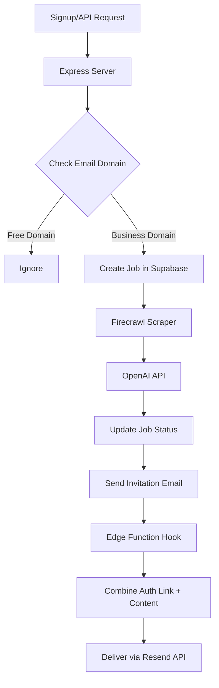

# Agent Smith - AI-Powered Personalized Email System

## Project Overview
Agent Smith is an API service that processes business signups, researches domains via web scraping, generates personalized email content using AI, and delivers these directly to users via email authentication flows.
## Tech Stack

- **Backend**: Node.js with Express
- **Deployment**: Vercel
- **Database & Auth**: Supabase (PostgreSQL)
- **Web Scraping**: Firecrawl API
- **AI Generation**: OpenAI API
- **Email Delivery**: Resend API
- **Authentication**: Supabase Auth with magic links
- **API Security**: API key validation for service integrations



## Core Components

1. **Email Processor** (`emailProcessor.js`): Orchestrates the workflow
2. **Domain Checker** (`domainChecker.js`): Validates if email is from a business domain
3. **Job Store** (`jobStore.js`): Manages job persistence in Supabase
4. **Web Scraper** (`webScraper.js`): Uses Firecrawl API to extract website data
5. **Email Generator** (`emailGenerator.js`): Uses OpenAI to generate personalized emails
6. **Email Hook** (`supabase/functions/send-email-hook`): Intercepts auth emails and adds personalized content

MVP System ArchitectureDiagram: @docs/system-architecture.mermaid

Implementation Guide
1. Project Setup: @docs/project-setup.sh

2. Core Implementation
   - Email Processing Workflow: src/emailProcessor.js
   - Domain Checker: src/domainChecker.js
   - Job Store: src/jobStore.js
   - Website Scraper: src/webScraper.js
   - Email Generator: src/emailGenerator.js
   - Slack Notifier: src/slackNotifier.js

3. Database Setup
   - Supabase migrations in supabase/migrations/
   - Jobs table for tracking processing status
   - Companies and prompt templates for multi-tenant support

4. Vercel Deployment
   - Deploy as serverless functions
   - Configure environment variables for API keys

Additional Setup Requirements

Dependencies:
```bash
npm install serverless-http @supabase/supabase-js --save
```

## Key Features

1. **Business Domain Filtering**: Automatically filters out free email providers to focus on business users
2. **Web Scraping**: Extracts company information from business websites using Firecrawl API
3. **AI-Generated Content**: Creates personalized email content based on scraped business data
4. **Seamless Authentication**: Uses magic link authentication with personalized content delivery
5. **Multi-tenant Support**: Supports multiple companies with custom email templates
6. **Delayed Invitation**: Sends user invitations only after content generation is complete
7. **Background Processing**: Handles jobs asynchronously with retry mechanism

## Project Structure
```
agent-smith/
├── .env
├── package.json
├── server.js
├── src/
│   ├── domainChecker.js
│   ├── emailGenerator.js
│   ├── emailProcessor.js
│   ├── jobStore.js
│   ├── companyManager.js
│   ├── supabaseClient.js
│   └── webScraper.js
├── api/
│   └── cron/
│       └── process-jobs.js
├── supabase/
│   ├── migrations/
│   │   ├── 20250405094700_create_jobs_table.sql
│   │   ├── 20250414161800_allow_service_role_access_to_jobs.sql
│   │   ├── 20250414164300_add_invitation_pending_column.sql
│   │   └── [additional migration files]
│   └── functions/
│       └── send-email-hook/
│           └── index.ts
├── public/
│   ├── index.html
│   ├── login.html
│   ├── dashboard.html
│   └── css/
│       └── [styles]
└── docs/
    ├── overview.md
    ├── email/
    │   ├── 01-overview.md
    │   └── 02-backend-changes.md
    └── [additional documentation]
```

## Environment Variables
```
OPENAI_API_KEY=your_openai_api_key
FIRECRAWL_API_KEY=your_firecrawl_api_key
SUPABASE_URL=your_supabase_url
SUPABASE_SERVICE_ROLE_KEY=your_supabase_service_role_key
API_KEY=your_api_key_for_authentication
RESEND_API_KEY=your_resend_api_key
RESEND_SENDER_EMAIL=sender@yourdomain.com
SITE_URL=https://your-app-url.com
```


Deployment Instructions

Local development:
```bash
npm install
node server.js
```

API Endpoints
- `POST /api/process-signup`: Main endpoint to process new signups
- `GET /api/jobs`: Lists all active jobs
- `GET /api/job-status/:jobId`: Checks status of a specific job
- `GET /api/test-connectivity`: Tests connectivity to external services
- `GET /api/test-firecrawl`: Tests the Firecrawl SDK

Database Schema

**Jobs Table**
```sql
CREATE TABLE public.jobs (
  id UUID PRIMARY KEY DEFAULT uuid_generate_v4(),
  email TEXT NOT NULL,
  name TEXT NOT NULL,
  domain TEXT NOT NULL,
  status TEXT NOT NULL DEFAULT 'pending',
  created_at TIMESTAMP WITH TIME ZONE DEFAULT NOW(),
  updated_at TIMESTAMP WITH TIME ZONE DEFAULT NOW(),
  completed_at TIMESTAMP WITH TIME ZONE,
  scrape_job_id TEXT,
  scrape_result JSONB,
  email_draft JSONB,
  error_message TEXT,
  retry_count INTEGER DEFAULT 0
);
```

Multi-Tenant Support

See the detailed implementation guide in [multi-tenant-prompt-implementation.md](./multi-tenant-prompt-implementation.md) for adding support for multiple companies with custom email templates.


DO NOT CHANGE BELOW!!!!!

Testing The API
Invoke-WebRequest -Uri "https://agent-smith.magloft.com/api/process-signup" `
  -Method POST `
  -Headers @{
    "Content-Type" = "application/json"
    "X-API-Key" = "as_987654321"
  } `
  -Body '{"email":"shawn@pastryartsmag.com","name":"Shawn Wenner"}'


Invoke-WebRequest -Uri "https://agent-smith.magloft.com/api/jobs" `
  -Method GET `
  -Headers @{
    "X-API-Key" = "em4il_p3rs0n_ag3nt_hj49dh4kl0s74jh31"
  } `

